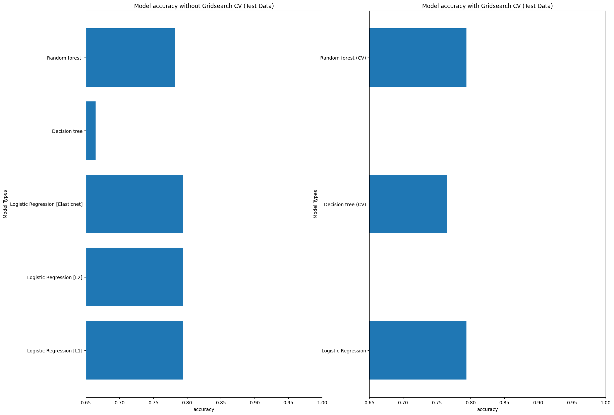

# Predicting Loan Approval using Logistic Regression, Decision Trees, and Random Forest

## 📖 Project Overview
This project aims to build and compare machine learning models to predict loan eligibility.  
We implement and tune **Logistic Regression** (with L1, L2, and ElasticNet regularization), **Decision Tree**, and **Random Forest** classifiers, evaluating their performance **with and without hyperparameter tuning**.

---

## 🧪 Methodology
- **Data Preprocessing**: Handled missing values, encoded categorical variables, and scaled numerical features.  
- **Baseline Model Training**: Trained initial models:
  - Logistic Regression (L1, L2, ElasticNet penalties)  
  - Decision Tree  
  - Random Forest  
- **Hyperparameter Tuning**: Optimized models using cross-validation to find the best parameters.  
- **Evaluation**: Models were evaluated based on Accuracy, Precision, Recall, and F1-Score.  

---

## 📊 Dataset Information
- **Total Samples**: 564 (394 train, 170 test)  
- **Class Distribution (Train)**: 120 (Class 0), 274 (Class 1)  
- **Class Distribution (Test)**: 53 (Class 0), 117 (Class 1)  

> ⚠️ The dataset is imbalanced, which was considered in evaluation using weighted averages.

---

## 📈 Results and Comparison

### Model Performance Summary

| Model                          | Test Accuracy | Precision (Macro Avg) | Recall (Macro Avg) | F1-Score (Macro Avg) | Key Observation |
|--------------------------------|---------------|------------------------|---------------------|-----------------------|-----------------|
| Logistic Regression [L1]        | 79.41%        | 0.843                  | 0.680               | 0.701                 | Best test accuracy. High precision for Class 0 |
| Logistic Regression [L2]        | 79.41%        | 0.843                  | 0.680               | 0.701                 | Identical performance to L1 |
| Logistic Regression [ElasticNet]| 79.41%        | 0.843                  | 0.680               | 0.701                 | Identical performance to L1 and L2 |
| Decision Tree                   | 67.65%        | 0.630                  | 0.636               | 0.632                 | Severely overfit (100% train vs. 67.65% test) |
| Random Forest                   | 78.24%        | 0.784                  | 0.682               | 0.700                 | Good balance, less overfit than single tree |
| Decision Tree (CV)              | 79.41%        | 0.843                  | 0.680               | 0.701                 | CV successfully mitigated overfitting |
| Random Forest (CV)              | 79.41%        | 0.843                  | 0.680               | 0.701                 | Excellent performance post-CV |

---

## 🔍 Detailed Analysis

### Logistic Regression Models
**Test Results**:
- Accuracy: 79.41%  

**Confusion Matrix**:  
- True Negatives (Class 0): 20  
- False Positives: 33  
- False Negatives: 2  
- True Positives (Class 1): 115  

**Analysis**:  
These models excel at identifying Class 1 (**recall = 0.983**) but struggle with Class 0 (**recall = 0.377**).  
However, predictions for Class 0 are highly precise (**precision = 0.909**).

---

### Decision Tree Classifier
**Train vs. Test Results**:
- Train Accuracy: 100.00%  
- Test Accuracy: 67.65%  

**Analysis**:  
The perfect training score with poor test performance indicates **severe overfitting**.

---

### Random Forest Classifier
**Train vs. Test Results**:
- Train Accuracy: 100.00%  
- Test Accuracy: 78.24%  

**Analysis**:  
While also overfitting on training, the test accuracy is much higher compared to a single tree, demonstrating the **power of ensemble learning**.  
It shows more balanced precision across classes.

---

### Cross-Validated Models
**Analysis**:  
Cross-validation effectively solved overfitting for both tree-based models, bringing performance up to **match Logistic Regression models**.

---

## ✅ Conclusion
- **Logistic Regression**, **tuned Decision Trees**, and **tuned Random Forests** all achieve **79.41% test accuracy** after optimization.  

### Final Recommendations:
- **For interpretability**: Choose Logistic Regression (simpler decision boundaries).  
- **For handling complex patterns**: Choose tuned Random Forest (robust to nonlinearities and interactions).  

⚠️ **Critical Consideration**:  
All top models strongly favor Class 1 (high recall) but sacrifice recall for Class 0.  
Depending on business priorities (e.g., minimizing risk vs. maximizing approvals), this trade-off must be carefully evaluated.  

Hyperparameter tuning was **crucial** for improving performance and reducing overfitting in tree-based models.

---

## 🛠️ Technical Implementation

### Models Used
- `LogisticRegression` (with `penalty='l1'`, `penalty='l2'`, `penalty='elasticnet'`)  
- `DecisionTreeClassifier`  
- `RandomForestClassifier`  
- `GridSearchCV` for hyperparameter tuning  

### Evaluation Metrics
- Accuracy  
- Precision  
- Recall  
- F1-Score  
- Confusion Matrix  

---

## 👤 Author
**Mostafa Abdelrashid**

